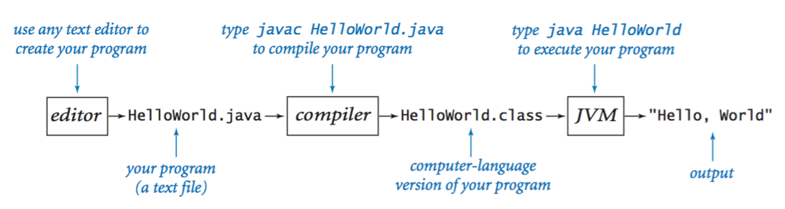

# Java 
  
*A language so revolutionary that it was named after some guy getting a cup of coffee in his office.*

### Basics

- Interfaces are an abstract blueprint on how to create a class.  
- Classes are a blueprint of an object that is stored in the heap in memory.  
- Java is almost entirely an object oriented programming language, basically everything is an 
object with methods.
- The exception to the rule are primitive types (byte, short, int, long, float, double, boolean, and char)
- Primative types have wrapper objects, these can be null, primatives can never be null.

### Running Java Programs
Build tools like maven bundle apps together into .jar (**J**ava **Ar**chive) files. These files contain
.class files (compiled .java files) images and more... Based on zip format.

You must define a class with a main function in the form of:
```java
//SomeClass.java
public class SomeClass {
    public static void main(String[] args){
      //...your program
    }
}
```
the `main` function serves as the entry point for the program, and can accept any number of arguments. When
the program must first be compiled before it can be executed. The flow goes as follows:

You start off with .java files which get compiled into .class files and then are exectued by the Java 
Virtual Machine.



### Directory Structure
For some bananas reason java devs decided that to avoid namespace collisions they would
do a reverse domain name directory structure, so when sharing packages, the directory structures would 
always be different. For example, `com.jsonbateman.app` would be my app structure for [jsonbateman.com](jsonbateman.com).
This is what a maven project looks like, for example.

     jsonbateman_project/
       │
       ├─ src/
       │  ├─ main/
       │  │  └─ java/
       │  │     └─ com/
       │  │        └─ jsonbateman/
       │  │            └─ app/
       │  │               └─ App.java
       │  └─ test/
       │     └─ java/
       │        └─ com/
       │           └─ jsonbateman/
       │               └─ app/
       │                  └─ AppTest.java
       │
       ├─ target/      
       │  ├─ classes/
       │  ├─ other_generated_folders/
       │  └─ jsonbateman-1.0.SNAPSHOT.jar   
       │
       └─ pom.xml    

For maven projects the **pom.xml** file contains the information required to build the project in the way you 
want.

`mvn clean verify` Is a command to verify and build a project based on options specified in the Pom.xml. 
This command generates a target directory and creates the jsonbateman-1.0.SNAPSHOT.jar if configured as such in the pom. 

```XML
<!-- pom.xml -->
<groupId>com.jsonbateman.app</groupId>
<artifactId>jsonbateman</artifactId>
<version>1.0-SNAPSHOT</version>
```

you can use the .jar file to run java files using all the classes provided in the .jar

    java -cp target/jsonbateman-1.0-SNAPSHOT.jar com.jsonbateman.app.App

_Note_: Why not just do `src/main/java/com_jsonbateman_app`? wouldn't that avoid namespace collisions and stop people from 
having to open 3 folders everytime? Doesn't really matter ig because we're sticking to convention.

### Autoboxing
You cannot put primative values into a collection, collections can only hold object reference. To do this you must
__box__ primative values into a wrapper class (i.e. Integer for int). If you must later get a primative 
type, you must __unbox__ that type using the Integer.intValue method (in the case of ints).

Because of this java implements something called Autoboxing, which automatically boxes and unboxes interchangable
primatives (such as int) with their wrapper class (Integer). This makes it so you can mostly ignore the type
issues of converting from Integer to int and visa versa. However, it comes at a performance cost because all the extra
objects must be garbage collected, and should not be used for critical loops. From the javadocs: 

> So when should you use autoboxing and unboxing? Use them only when there is an “impedance mismatch” between reference types and primitives, for example, when you have to put numerical values into a collection. It is not appropriate to use autoboxing and unboxing for scientific computing, or other performance-sensitive numerical code. An Integer is not a substitute for an int; autoboxing and unboxing blur the distinction between primitive types and reference types, but they do not eliminate it.
